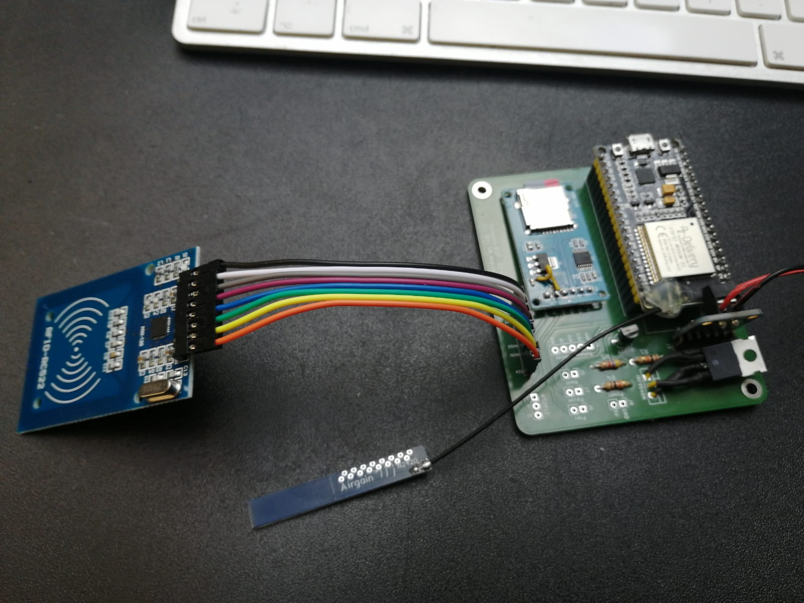

## ESP32 I2S Breakout Carrier PCB
This is a simple PCB which makes wiring the whole stuff much easier. It contains connections for all components which are described in the projects wiring table. 
I used an ESP32 form AZ-Delivery but every Pin-Compatible ESP32 Board will do the job.

The image shows my first boards which came with a litte wiring bug. The bug is fixed in the current version.

I ordered my board at aisler.net, there is already and upload available.

[https://aisler.net/p/YTYZJZMM](https://aisler.net/p/YTYZJZMM)

## What Remains
The PCB does not provide an option for charing or power management (including step down/up). It provides a pinout for 5V Input.

## Antenna Improvements
It is recommended to solder an external antenna to the ESP32 for preventing connection issues. Cheap ESP32 boards come with an antenna which is laying on the PCB. The newer ones provide an ESP32 board where the antenna part protrudes over the edge. 

You can find some useful tips for soldering an antenna to the old ones here:
[https://community.home-assistant.io/t/how-to-add-an-external-antenna-to-an-esp-board/131601](https://community.home-assistant.io/t/how-to-add-an-external-antenna-to-an-esp-board/131601)

## Disclaimer
PCB-circuit is provided 'as is' without warranty. It was made to keep wiring much simpler. However: it runs fine without any problems in my Tonuinos.