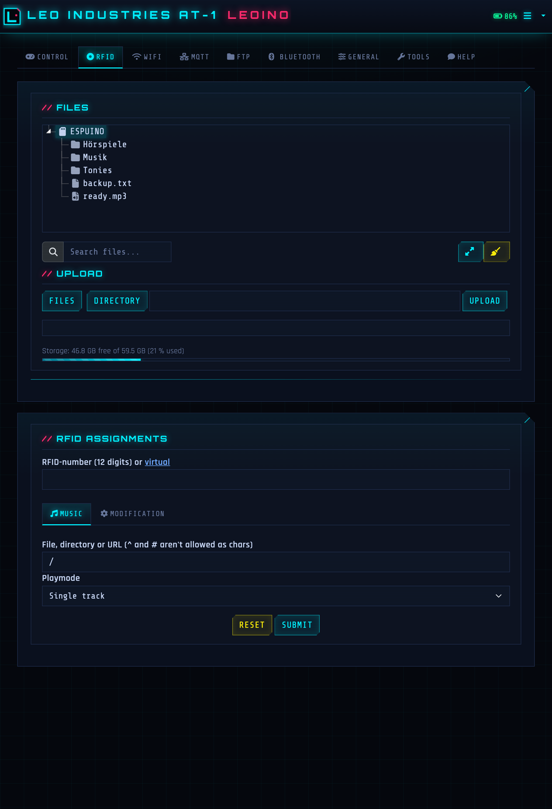
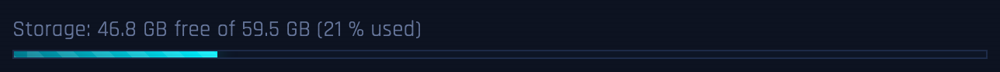
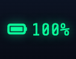
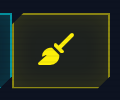
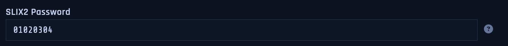

<div align="center">


# LEO INDUSTRIES AT-1

`// RFID AUDIO PLAYER :: ESP32 :: CYBERPUNK EDITION`

[-00f0ff?style=flat-square&labelColor=05070d)](https://github.com/biologist79/ESPuino)
[](LICENSE)
[](platformio.ini)

</div>

> **LEO INDUSTRIES AT-1** is a private fork of [ESPuino](https://github.com/biologist79/ESPuino)
> (branch `dev`) — an RFID-controlled audio player based on the ESP32. This fork gives the web
> interface a complete cyberpunk overhaul and adds a number of features around RFID detection,
> Bluetooth, backups and convenience. For the upstream hardware, wiring and general documentation
> please refer to the [original documentation](https://forum.espuino.de/c/dokumentation/anleitungen/10).

---

# // HARDWARE

The physical build — a 3D-printed enclosure housing an ESP32, a PN5180 RFID reader, speaker and
battery.

> 🚧 _This section will be filled with photos of the 3D-printed unit and details of the installed
> hardware (board, reader, wiring, battery, enclosure)._

<!--
Planned content:
- Photos of the printed enclosure (front / open / internals)
- Bill of materials: ESP32 board, PN5180 reader, amp/speaker, battery, LEDs, buttons
- Wiring / pinout notes specific to this build
- STL / print settings reference
-->

---

# // SOFTWARE

The firmware is based on ESPuino's `dev` branch with a cyberpunk web interface and a set of
fork-specific features. The full interface (default RFID tab shown below, live from the device):

<div align="center">



</div>

## // Differences to upstream

All changes compared to upstream/`dev`, each with a reference to its commit.

### Web interface

The management and access point pages were completely rebuilt in a cyberpunk style — neon
palette, scanlines, `Orbitron`/`Rajdhani`/`Share Tech Mono` typography, a custom login page, the
upstream Bluetooth scan UI restyled to match, the device branding in the navbar and an embedded
neon logo that doubles as the SVG favicon ([`8d9725c`](../../commit/8d9725c)):

<div align="center"></div>

| Change | Commit |
| --- | --- |
| PWA support: web app manifest + app icon, "add to home screen" with proper icon and name | [`a59fe0b`](../../commit/a59fe0b) |
| Full backup: export/import of all settings + RFID assignments as JSON, WiFi credentials optional | [`7f2e4ae`](../../commit/7f2e4ae) |
| Equalizer profiles: dropdown presets (Flat / Music / Audiobook-Speech / Deep voices / Custom) on top of the 3-band tone control; speech presets cut bass and lift mids/highs so deep narrator voices stay intelligible, persisted in NVS. Profiles can also be assigned per file or directory (right-click in the file browser) — e.g. set the speech profile for all Bibi Blocksberg episodes at once. The active profile can be cycled with the bindable command **154** (button/RFID modifier) and set/reported via the MQTT topic `equalizer` (`flat`/`music`/`speech`/`voiceBoost`) | [`300b9dd`](../../commit/300b9dd) |
| Blinking "OK" indicator next to the battery replaces the generic "action successful" toast | [`0870ccc`](../../commit/0870ccc) |
| Play/pause button in the RFID tab plays the highlighted file/folder (and pauses running playback) | [`8d3d196`](../../commit/8d3d196) |
| Cyberpunk footer below the interface (neon "LEO INDUSTRIES // DIVISION: AUDIO" branding) | [`c21f8bf`](../../commit/c21f8bf) |
| SD card cleanup: removes macOS metadata (`.DS_Store`, `._*`, Spotlight/Trashes) with one click | [`5f38a51`](../../commit/5f38a51) |
| Live log: the log dialog refreshes every 2 s and follows the end of the log | [`d326faa`](../../commit/d326faa) |
| Drag & drop: upload files by dropping them from the file manager onto the file tree | [`e4972fe`](../../commit/e4972fe) |
| Password protection: single password (no username), 90-day session cookie, logout menu entry, brute-force lockout; inactive in hotspot mode | [`6e14646`](../../commit/6e14646) |
| Log download as a text file | [`c5ece03`](../../commit/c5ece03) |
| Battery indicator in the navbar with a low-battery warning toast | [`3b519ae`](../../commit/3b519ae) |
| SD card capacity gauge in the files tab and the info dialog | [`a2b9f2b`](../../commit/a2b9f2b) |
| FTP server can be stopped from the web interface (start button turns into a stop button) | [`f0906b4`](../../commit/f0906b4) |
| Bluetooth modes can be stopped from the web interface; commands 143/144 switch modes directly via buttons | [`0c3edd0`](../../commit/0c3edd0) |

#### Feature highlights

| | |
| --- | --- |
|  | **SD capacity gauge** — free / total space below the file browser ([`a2b9f2b`](../../commit/a2b9f2b)) |
|  | **Battery indicator** — live charge level in the navbar ([`3b519ae`](../../commit/3b519ae)) |
|  | **SD cleanup** — one click removes macOS metadata junk ([`5f38a51`](../../commit/5f38a51)) |
|  | **SLIX2 password** — read protected ICODE-SLIX2 tags ([`d3cc69c`](../../commit/d3cc69c)) |

### RFID & audio

| Change | Commit |
| --- | --- |
| Tag removal detected via consecutive-miss counter instead of a wall-clock timeout: pause after ~0.5 s, immune to phantom dropouts and task starvation | [`7e851fb`](../../commit/7e851fb) |
| Vendored PN5180 library with fast no-card detection: read attempts on an empty field take ~25 ms instead of ~230 ms (no more 200 ms timeout) | [`8762784`](../../commit/8762784) |
| SLIX2 password support for protected ICODE-SLIX2 tags | [`d3cc69c`](../../commit/d3cc69c) |
| Configurable idle LED and progress bar colors | [`bdc54e5`](../../commit/bdc54e5) |
| Ready sound on cold start | [`c051c40`](../../commit/c051c40) |
| Cyberpunk "Data Drop" idle LED animation | [`f20b111`](../../commit/f20b111) |
| Selectable idle animation (standard idle dots or cyberpunk "Data Drop") in the LED settings; defaults to standard | [`7174669`](../../commit/7174669) |
| Improved button responsiveness and track navigation seek options | [`76e1535`](../../commit/76e1535) |
| Unlocking controls via button press while locked | [`d83e15f`](../../commit/d83e15f) |
| Support for a 6th button | [`b116151`](../../commit/b116151) |

## // Flashing

```bash
pio run -e complete -t upload
```

The web interface (HTML, locales, manifest, icons) is embedded into the firmware automatically
during the build. Alternatively use OTA: Tools → firmware update with
`.pio/build/complete/firmware.bin`.

## // Upstream sync

The fork follows upstream/`dev`. The remote is already set up:

```bash
git fetch upstream
git rebase upstream/dev
```

## // License

Same as the original: [GPL-3.0](LICENSE). The original README content (hardware, HALs, wiring)
can be found in the [ESPuino documentation](https://github.com/biologist79/ESPuino#readme).
