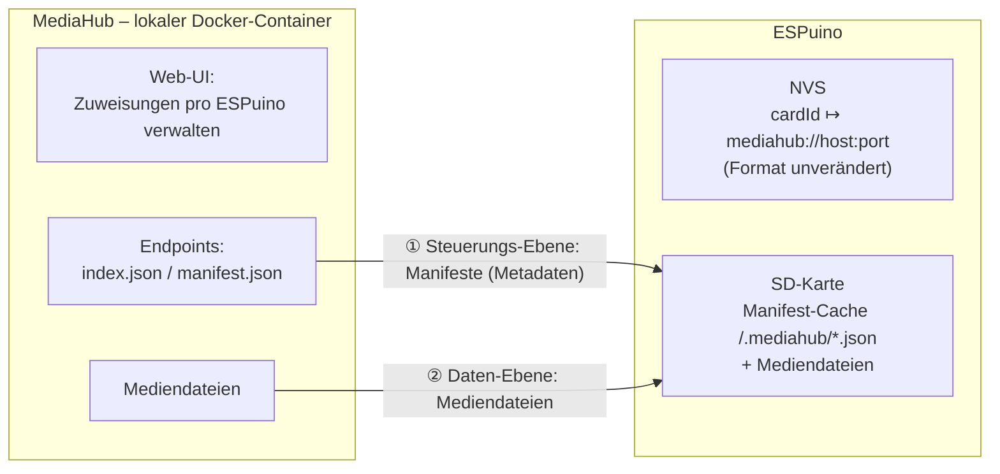
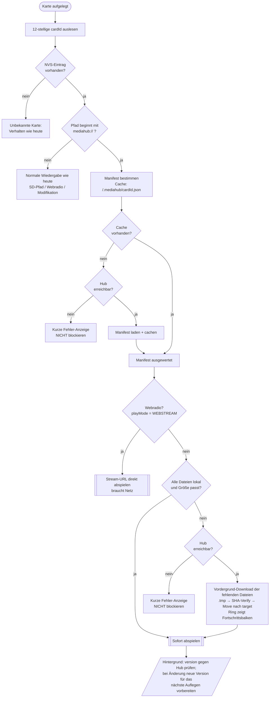

# MediaHub — Detailspezifikation (Entwurf 1)

*Stand: 14. Juli 2026 · Branch `feature-mediahub` · Status: Konzept, noch kein Code*

## 1. Worum es geht

Manche Nutzer betreiben **mehrere ESPuinos** im Haushalt und möchten die **RFID-Zuweisungen zentral verwalten**, statt jede Karte an jedem Gerät einzeln anzulernen. Beispiel: Zwei Kinder tauschen Karten, und auf jedem Gerät passiert dasselbe.

Der **MediaHub** ist dafür ein **lokal betriebener Docker-Container** (kein Cloud-Dienst) mit einem ansprechenden Web-Interface. Dort verwaltet man pro ESPuino, welche Karte welchen Inhalt abspielt. Die ESPuinos holen sich diese Informationen und die zugehörigen Mediendateien selbstständig.

Es ist ein Feature für wenige Power-User; wer es nicht nutzt, bemerkt nichts davon.

## 2. Nicht-Ziele

- **Keine Cloud.** Der Hub läuft lokal beim Nutzer (Docker).
- **Nichts wird auf der RFID-Karte gespeichert.** Wir arbeiten ausschließlich mit der ausgelesenen 12-stelligen Nummer.
- **Keine Änderung des NVS-Speicherformats.**
- **Kein Streaming der eigenen Mediathek.** Datei-Inhalte werden auf die SD geladen und lokal abgespielt. (Webradio-Zuweisungen werden hingegen direkt gestreamt — siehe §7.3.)
- **Kein Blockieren der Wiedergabe durch Netzwerk-Timeouts** (Offline-/Unterwegs-Tauglichkeit ist Pflicht).

## 3. Grundprinzipien

1. **Lokal zuerst.** Ist der Inhalt lokal vorhanden und plausibel (Größe), wird **sofort** abgespielt — ohne Netzwerkzugriff. Das muss auch unterwegs (Auto, kein Hub erreichbar) funktionieren.
2. **Nie blockierende Lookups.** Ein nicht erreichbarer Hub darf **niemals** zu langen Timeouts führen. Hintergrundaktionen sind erlaubt, dürfen aber nichts blockieren.
3. **Integrität lokal über Größe, beim Download über SHA-256.** Ein vollständiges Neu-Hashen lokaler (u. U. 100 MB großer) Dateien auf dem ESP32 ist keine Option und findet **nie** statt.
4. **Der Hub ist die Quelle der Wahrheit.** Zielordnerstruktur, playMode und Dateiliste gibt der Hub vor.
5. **Robuster Download.** Immer erst in `.tmp`, erst nach erfolgreicher Verifikation an den Zielort verschieben. Ein abgebrochener Download hinterlässt nie eine kaputte „echte" Datei.

## 4. Architektur im Überblick

Es gibt genau **zwei Beteiligte** — den **MediaHub** und den **ESPuino** — mit **zwei Datenströmen** dazwischen. Der ESPuino **holt** (pull) beides bei Bedarf vom Hub und legt es auf seiner SD-Karte ab:

- **① Steuerungs-Ebene — Metadaten:** die kleinen **Manifeste** (welche Karte hat welchen Inhalt, mit Zielpfad, Größen, Hashes, `version`).
- **② Daten-Ebene — Inhalte:** die eigentlichen **Mediendateien**.

Die Zuweisung selbst (Kartennummer → Hub-Adresse) liegt unverändert im **NVS**; der heruntergeladene Inhalt und der Manifest-Cache liegen auf der **SD-Karte**.



Dazu **zwei Mechanismen**, die festlegen, *wann* dieser Abgleich passiert:

- **(a) Pro Karte, beim Auflegen ausgelöst** — Fokus dieser Spezifikation.
- **(b) Sync-Job über alle Karten** des Geräts (nacheinander) — später, baut auf (a) auf.

Beide Mechanismen teilen sich dieselbe Kernoperation `MediaHub_EnsureCard(cardId)` (siehe §10).

## 5. NVS-Integration (ohne Formatänderung)

Der NVS-Wert bleibt `#`-getrennt: `<pfad> # <playMode> # …` (siehe `RfidCommon.cpp`). Für eine MediaHub-Karte steht im **Pfad-Feld** ein eigenes Schema statt eines SD-Pfads:

```
mediahub://<host:port>
```

- Ein **eigenes Schema** ist nötig, weil der AudioPlayer einen Pfad, der mit `http` beginnt, als **Webradio** interpretiert (`strncmp("http", …, 4)` in `AudioPlayer.cpp`). `mediahub://` kollidiert damit nicht.
- Die Basis-Adresse ist für **alle** Karten identisch → „Karte einschreiben" heißt einfach: Pfad-Feld auf die Hub-Basis setzen (vom Hub aus bulk-verteilbar).
- `<espId>` (Hostname/MAC) kennt das Gerät selbst, `<cardId>` ist der NVS-Schlüssel → ESPuino baut daraus die konkrete Manifest-URL.
- Der `playMode`-Token im NVS bleibt erhalten, wird zur Laufzeit aber vom Manifest überschrieben (siehe §8). Er dient nur als **Fallback** beim allerersten Auflegen ohne Manifest.
- **Aktivierung rein zur Laufzeit — kein Compile-Flag.** Der MediaHub-Code ist immer im Firmware-Image, wird aber nur aktiv, wenn eine Karte eine `mediahub://`-Adresse trägt. Wer das Feature nicht nutzt, zahlt keine Laufzeitkosten. (Die schweren Abhängigkeiten — HTTP-Client, SHA, JSON — sind ohnehin für OTA/Webradio/Web-UI im Image.)

### 5.1 Registrierte Medienserver (Komfort im Web-UI)

Die Karten-ID lässt sich nur mit einem Kartenleser ermitteln — das Zuweisen passiert daher meist direkt am **ESPuino-Web-Interface** (Karte auflegen → ID wird automatisch ausgefüllt). Damit man dort nicht jedes Mal die `mediahub://`-URL von Hand eintippt, kann man im Web-Interface **Medienserver registrieren**:

- Eine kleine, gerätelokale Liste bekannter Hubs — je Eintrag ein **Anzeigename** + **Basis-Adresse** (`host:port`). Analog zur bestehenden Verwaltung „Netzwerke" (WLAN).
- Gespeichert als **eigener Settings-Eintrag** (NVS) — **nicht** im RFID-Zuweisungsformat. Die Vorgabe „NVS-Zuweisungsformat unverändert" bleibt gewahrt.
- Bei der RFID-Zuweisung wählt man den Server aus einem **Dropdown**; das Pfad-Feld wird automatisch mit `mediahub://<host:port>` befüllt.
- Ist nur ein Server registriert, wird er vorausgewählt. Optional kann das Web-UI die Erreichbarkeit prüfen (Test-Request an `/<espId>/index.json`).

Das ist reine Enrollment-Ergonomie; der Laufzeit-Ablauf (§11) bleibt unberührt.

## 6. Endpunkte

```
Manifest (pro Karte)   GET  http://<host:port>/<espId>/card/<cardId>/manifest.json
Index (für Job b)      GET  http://<host:port>/<espId>/index.json
Mediendateien          GET  <filesBaseUrl>/<files[].path>
```

## 7. Manifest-Format

### 7.1 Per-Karte-Manifest

```json
{
  "schema": 1,
  "cardId": "0123456789AB",
  "version": "9f86d081884c7d65...",
  "name": "Benjamin Blümchen – Folge 12",
  "playMode": 3,
  "target": "/Benjamin/Folge12",
  "filesBaseUrl": "http://192.168.1.50:8080/media/benjamin-12/",
  "files": [
    { "path": "01.mp3", "size": 5432101, "sha256": "9f86d0..." },
    { "path": "02.mp3", "size": 4998210, "sha256": "ef01ab..." }
  ]
}
```

| Feld | Bedeutung / Verwendung auf dem ESPuino |
|---|---|
| `schema` | Format-Version für Vorwärtskompatibilität. |
| `cardId` | Gegenprüfung, dass das Manifest zur aufgelegten Karte gehört. |
| `version` | **Opaker Änderungsstempel = SHA-256 des kanonischen Manifests, berechnet auf dem Hub.** Der ESPuino rechnet hier nichts, er **vergleicht nur Strings**. Grundlage der Änderungserkennung. Da es ein Content-Hash ist, kann der Hub das „Hochzählen" nicht vergessen. |
| `name` | Optional, nur für Logs/Web-UI. |
| `playMode` | ESPuino-`playMode`-Enum (`values.h`), z. B. 3 = Hörbuch. **Quelle der Wahrheit ist der Hub.** |
| `target` | **Vom Hub vorgegebener** Zielordner auf der SD (absoluter Pfad). Datei-Pfade sind relativ dazu. |
| `filesBaseUrl` | Download-Basis. Download-URL je Datei = `filesBaseUrl + path`. Entkoppelt Medien-Ablage vom Manifest. |
| `files[].path` | Relativ. Lokal → `target + "/" + path`, remote → `filesBaseUrl + path`. |
| `files[].size` | **Schneller lokaler Integritätscheck.** |
| `files[].sha256` | **Nur inkrementell während des Downloads** geprüft (HW-beschleunigt, WiFi ist der Flaschenhals). **Nie** über lokale Dateien neu berechnet. |

Den Gesamt-Fortschritt (Progress-Balken) berechnet der ESPuino aus der Summe der `files[].size` selbst.

### 7.2 Index (für Job b)

```json
{
  "schema": 1,
  "espId": "espuino-kinderzimmer",
  "cards": [
    { "cardId": "0123456789AB", "version": "9f86d0..." },
    { "cardId": "0123456789CD", "version": "3a7bd3..." }
  ]
}
```

Job b holt diese kleine Liste, vergleicht `version` mit dem lokalen Cache und lädt nur **geänderte** Per-Karte-Manifeste nach.

### 7.3 Webradio-Variante

Trägt eine Karte einen Webradio-Sender, gibt es **keine Dateien** herunterzuladen — das Manifest beschreibt dann nur den Stream. Unterschieden wird am `playMode` (WEBSTREAM = 8):

```json
{
  "schema": 1,
  "cardId": "0123456789AB",
  "version": "...",
  "playMode": 8,
  "name": "Radio Beispiel",
  "stream": "http://radio.example/stream.mp3"
}
```

- Kein `target`, kein `filesBaseUrl`, kein `files`.
- ESPuino liest das Manifest, erkennt `playMode = WEBSTREAM` und übergibt dem AudioPlayer direkt die `stream`-URL — kein Download, keine Integritätsprüfung.
- Die `version`-/Änderungslogik gilt weiterhin (die Stream-URL kann sich zentral ändern).
- **Offline nicht abspielbar** — Webradio braucht prinzipbedingt Netz.

Gemischte `LOCAL_M3U`-Listen (SD-Dateien und Webstreams gemischt) sind bewusst eine spätere Ausbaustufe (§15).

## 8. playMode: Manifest vor NVS

Für MediaHub-Karten ist der `playMode` aus dem **Manifest** maßgeblich; der NVS-Token wird zur Laufzeit ignoriert (bleibt aber als Fallback bestehen). Vorteil: Eine zentrale Änderung (z. B. „Einzeltitel" → „Hörbuch") propagiert über den normalen Manifest-Refresh, ohne das NVS anzufassen.

*Offen / optional (niedrige Priorität):* Rückpropagierung des geänderten `playMode` ins NVS (lazy write-back). Bewusst zurückgestellt wegen zusätzlichem Flash-Schreibvorgang bei geringem Nutzen.

## 9. Integrität, Änderungserkennung, Force Refresh

- **Lokaler Integritätscheck:** ausschließlich über **Dateigröße**. Schnell, kein Hashing großer Dateien.
- **Download-Verifikation:** SHA-256 **inkrementell** während des Downloads gegen `files[].sha256`. Fängt abgeschnittene/korrupte Downloads ab, die zufällig die richtige Größe hätten.
- **Änderungserkennung:** über `version`. Weicht die lokal gecachte `version` von der des Hubs (Index oder frisches Manifest) ab, gilt der lokale Stand als veraltet → Neu-Download.
- **Force Refresh (Escape-Hatch):** ignoriert den lokalen Zustand und lädt neu — deckt die bewusste Schwäche des Größen-Checks ab (gleiche Größe, anderer Inhalt). Technisch: gecachte `version` (und optional die lokalen Dateien) verwerfen → normaler Download-Pfad greift.
  - **pro Karte** (Button im Hub-UI / Admin-Karte)
  - **für alle Karten** (Neuaufsetzen von Job b)

## 10. Kernoperation `MediaHub_EnsureCard`

Beide Mechanismen nutzen dieselbe Primitive; nur der Kontext (Vordergrund + Play vs. stiller Hintergrund) unterscheidet sich.

```
MediaHub_EnsureCard(cardId, {allowDownload, showProgress}):
    manifest ← lokaler Cache /.mediahub/<cardId>.json
    wenn kein Cache und Hub erreichbar:
        manifest ← GET .../manifest.json;  Cache schreiben
    wenn immer noch kein Manifest:
        return NICHT_VERFUEGBAR            // offline & nie geladen

    wenn manifest ist Webradio (playMode WEBSTREAM):
        return BEREIT                       // nichts herunterzuladen; Wiedergabe streamt direkt

    fehlend ← alle files, deren lokale Datei fehlt oder deren Größe ≠ manifest.size
    wenn fehlend leer:
        return BEREIT                       // sofort spielbar

    wenn nicht allowDownload oder Hub nicht erreichbar:
        return UNVOLLSTAENDIG               // z. B. offline, Teil-Ordner

    für jede Datei in fehlend:
        download → <target>/<path>.tmp
        SHA-256 inkrementell prüfen (gegen files[].sha256)
        bei Erfolg: move .tmp → <target>/<path>;  Fortschritt anzeigen (wenn showProgress)
        bei Fehler/Abbruch: .tmp entfernen → return FEHLER
    return BEREIT
```

- **(a)** ruft `EnsureCard(card, allowDownload=true, showProgress=true)` im **Vordergrund** auf; bei `BEREIT` folgt die Wiedergabe. Zusätzlich wird nach dem Start ein **leichter Hintergrund-`version`-Check** angestoßen.
- **(b)** ruft `EnsureCard(card, allowDownload=true, showProgress=false)` still in einer Schleife über alle Karten auf.

## 11. Ablauf beim Kartenauflegen (Mechanismus a)



### Textuelle Zusammenfassung des kritischen Pfads

1. Karte → `cardId`. NVS-Lookup (sofort, lokal).
2. Kein `mediahub://`-Präfix → alles wie bisher (SD, Webradio, Modifikation).
3. `mediahub://` → Manifest aus Cache (oder, falls fehlend und Hub erreichbar, einmalig laden).
4. Alle Dateien lokal & Größen passen → **sofort spielen** (offline-tauglich).
5. Sonst & Hub erreichbar → **Vordergrund-Download** mit Ring-Fortschritt, danach spielen.
6. Sonst (Hub weg) → **kurze Fehleranzeige, kein Blockieren**.
7. Nach dem Start: **Hintergrund-`version`-Check**; bei Änderung neue Version für das nächste Mal vorbereiten.

## 12. LED / Fortschritt

Der Download-Fortschritt wird auf dem Neopixel-Ring angezeigt. **Wichtig:** Nicht über `Led_ShowOtaProgress()` — das suspendiert den `Led_Task` und blockiert andere Animationen. Stattdessen eine **eigene, nicht-suspendierende Download-Animation** (neuer `LedAnimationType::Download` oder Wiederverwendung von `Animation_Progress`), die sich in die Prioritätenlogik des `Led_Task` einreiht (`Led.cpp`).

## 13. Download-Robustheit

- Zielverzeichnis (`target`) wird bei Bedarf angelegt.
- Jede Datei wird nach `<target>/<path>.tmp` geladen und erst nach erfolgreicher SHA-Prüfung per Rename an den endgültigen Ort verschoben.
- Abbruch/Fehler (Netzwerk weg, Hub-Fehler, SD-Fehler) → `.tmp` entfernen, klare Fehlermeldung, kein Zombie-File.
- Kurze Connect-Timeouts (schnelles Scheitern), damit ein unerreichbarer Hub nie hängt.

## 14. Offline-Verhalten (Unterwegs)

- `mediahub://`-Karte, Inhalt lokal vollständig → **spielt normal**, kein Netzwerkzugriff nötig.
- Inhalt fehlt/unvollständig und Hub nicht erreichbar → **kurze Fehleranzeige**, kein Timeout, kein Hängen.
- Der Manifest-Cache auf der SD (`/.mediahub/<cardId>.json`) macht `playMode`, `target` und die erwarteten Größen offline verfügbar.
- **Webradio-Zuweisungen** brauchen prinzipbedingt Netz und sind offline nicht abspielbar (kurze Fehleranzeige).

## 15. Offene Punkte / später

- **Mechanismus (b)** — Sync-Job über alle Karten (Trigger, Zeitpunkt, Fortschritt) — bewusst zurückgestellt, Architektur ist aber vorbereitet.
- **Zeitpunkt des Manifest-/Assignment-Sync** — wann werden Zuweisungen ins NVS geschrieben (Ersteinrichtung)? Voraussetzung für den Offline-Fall.
- **`playMode`-Rückpropagierung ins NVS** — optional, niedrige Priorität.
- **Gemischte `LOCAL_M3U`-Listen** (SD-Dateien und Webstreams gemischt) — komplexer, spätere Ausbaustufe. Einfaches Webradio ist bereits im Scope (§7.3).
- **Authentifizierung / Absicherung** des Hub-Zugriffs — noch offen.
- **Aufräumen verwaister Medien** auf der SD, wenn eine Zuweisung entfernt/geändert wird.

## 16. Entscheidungslog

| # | Entscheidung |
|---|---|
| 1 | Lokaler Hub (Docker), keine Cloud. |
| 2 | Nichts auf der Karte; nur die 12-stellige Nummer. |
| 3 | NVS-Format unverändert; Hub-Adresse via `mediahub://` im Pfad-Feld. |
| 4 | Per-Karte-Manifest (+ Index-Endpoint für Job b), kein großes Sammel-Manifest. |
| 5 | `version` = Hub-seitiger Content-Hash (ESP32 vergleicht nur). |
| 6 | Lokale Integrität über Größe; SHA-256 nur inkrementell beim Download. |
| 7 | Force Refresh als Escape-Hatch (pro Karte / alle). |
| 8 | `playMode` aus dem Manifest maßgeblich; NVS-Token nur Fallback. |
| 9 | Erst-Download blockiert die Wiedergabe (mit Fortschrittsbalken); Änderungserkennung läuft im Hintergrund. |
| 10 | Eigene, nicht-suspendierende LED-Download-Animation statt `Led_ShowOtaProgress()`. |
| 11 | Kein `#ifdef` — MediaHub ist rein laufzeit-gesteuert, aktiv nur bei `mediahub://`-Karten. |
| 12 | Webradio unterstützt: Stream-Manifest (`playMode` WEBSTREAM) ohne Download; gemischte m3u später. |
| 13 | Medienserver im ESPuino-Web-UI registrierbar (Name + Basis-URL, eigener Settings-Eintrag); Dropdown füllt das `mediahub://`-Feld beim Zuweisen. |
