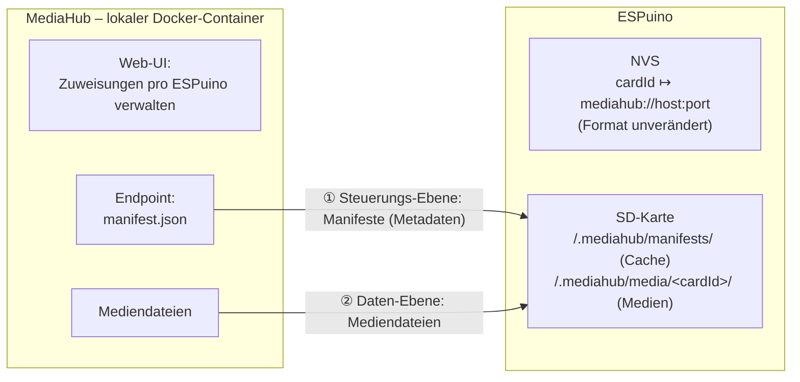

# MediaHub — Detailspezifikation (Entwurf 1)

*Stand: 14. Juli 2026 · Branch `feature-mediahub` · Status: Konzept, noch kein Code*

## 1. Worum es geht

Manche Nutzer betreiben **mehrere ESPuinos** im Haushalt und möchten die **RFID-Zuweisungen zentral verwalten**, statt jede Karte an jedem Gerät einzeln anzulernen. Beispiel: Zwei Kinder tauschen Karten, und auf jedem Gerät passiert dasselbe.

Der **MediaHub** ist dafür ein **lokal betriebener Docker-Container** (kein Cloud-Dienst) mit einem ansprechenden Web-Interface. Dort verwaltet man pro ESPuino, welche Karte welchen Inhalt abspielt. Die ESPuinos holen sich diese Informationen und die zugehörigen Mediendateien selbstständig.

Es ist ein Feature für wenige Power-User; wer es nicht nutzt, bemerkt nichts davon.

## 2. Nicht-Ziele

- **Keine Cloud.** Der Hub läuft lokal beim Nutzer (Docker).
- **Nichts wird auf der RFID-Karte gespeichert.** Wir arbeiten ausschließlich mit der ausgelesenen 12-stelligen Nummer.
- **Keine Änderung des NVS-Speicherformats.**
- **Kein Streaming der eigenen Mediathek.** Datei-Inhalte werden auf die SD geladen und lokal abgespielt. (Webradio-Zuweisungen werden hingegen direkt gestreamt — siehe §7.2.)
- **Kein Blockieren der Wiedergabe durch Netzwerk-Timeouts** (Offline-/Unterwegs-Tauglichkeit ist Pflicht).
- **Keine Authentifizierung / Absicherung des Hub-Zugriffs.** Der Hub ist ein lokaler, vertrauenswürdiger Dienst im Heimnetz.

## 3. Grundprinzipien

1. **Lokal zuerst.** Ist der Inhalt lokal vorhanden und plausibel (Größe), wird **sofort** abgespielt — ohne Netzwerkzugriff. Das muss auch unterwegs (Auto, kein Hub erreichbar) funktionieren.
2. **Nie blockierende Lookups.** Ein nicht erreichbarer Hub darf **niemals** zu langen Timeouts führen. Hintergrundaktionen sind erlaubt, dürfen aber nichts blockieren.
3. **Integrität lokal über Größe, beim Download über SHA-256.** Ein vollständiges Neu-Hashen lokaler (u. U. 100 MB großer) Dateien auf dem ESP32 ist keine Option und findet **nie** statt.
4. **Der Hub ist die Quelle der Wahrheit** für playMode und Dateiliste. Wo die Dateien auf der SD landen, bestimmt der ESPuino selbst (fester Medien-Root, §13.1).
5. **Robuster Download.** Immer erst in `.tmp`, erst nach erfolgreicher Verifikation an den Zielort verschieben. Ein abgebrochener Download hinterlässt nie eine kaputte „echte" Datei.

## 4. Architektur im Überblick

Es gibt genau **zwei Beteiligte** — den **MediaHub** und den **ESPuino** — mit **zwei Datenströmen** dazwischen. Der ESPuino **holt** (pull) beides bei Bedarf vom Hub und legt es auf seiner SD-Karte ab:

- **① Steuerungs-Ebene — Metadaten:** die kleinen **Manifeste** (welche Karte hat welchen Inhalt: Dateiliste, Größen, Hashes, `version`).
- **② Daten-Ebene — Inhalte:** die eigentlichen **Mediendateien**.

Die Zuweisung selbst (Kartennummer → Hub-Adresse) liegt unverändert im **NVS**; der heruntergeladene Inhalt und der Manifest-Cache liegen auf der **SD-Karte**.



Der Abgleich passiert ausschließlich **pro Karte, beim Auflegen** — gekapselt in der Kernoperation `MediaHub_EnsureCard(cardId)` (siehe §10). Einen geräteweiten Bulk-Sync gibt es bewusst **nicht**.

## 5. NVS-Integration (ohne Formatänderung)

Der NVS-Wert bleibt `#`-getrennt: `<pfad> # <playMode> # …` (siehe `RfidCommon.cpp`). Für eine MediaHub-Karte steht im **Pfad-Feld** ein eigenes Schema statt eines SD-Pfads:

```
mediahub://<host:port>
```

- Ein **eigenes Schema** ist nötig, weil der AudioPlayer einen Pfad, der mit `http` beginnt, als **Webradio** interpretiert (`strncmp("http", …, 4)` in `AudioPlayer.cpp`). `mediahub://` kollidiert damit nicht.
- Die Basis-Adresse ist für **alle** Karten identisch → „Karte einschreiben" heißt einfach: Pfad-Feld auf die Hub-Basis setzen (vom Hub aus bulk-verteilbar).
- `<espId>` (Hostname/MAC) kennt das Gerät selbst, `<cardId>` ist der NVS-Schlüssel → ESPuino baut daraus die konkrete Manifest-URL.
- Der `playMode`-Token im NVS wird auf den **neuen Wert `MEDIAHUB`** gesetzt (siehe §8). Er ist damit zugleich der **eindeutige Marker**, dass es sich um eine MediaHub-Karte handelt; der *tatsächliche* playMode für die Wiedergabe kommt aus dem Manifest.
- **Aktivierung rein zur Laufzeit — kein Compile-Flag.** Der MediaHub-Code ist immer im Firmware-Image, wird aber nur aktiv, wenn eine Karte eine `mediahub://`-Adresse trägt. Wer das Feature nicht nutzt, zahlt keine Laufzeitkosten. (Die schweren Abhängigkeiten — HTTP-Client, SHA, JSON — sind ohnehin für OTA/Webradio/Web-UI im Image.)

### 5.1 Registrierte Medienserver (Komfort im Web-UI)

Die Karten-ID lässt sich nur mit einem Kartenleser ermitteln — das Zuweisen passiert daher meist direkt am **ESPuino-Web-Interface** (Karte auflegen → ID wird automatisch ausgefüllt). Damit man dort nicht jedes Mal die `mediahub://`-URL von Hand eintippt, kann man im Web-Interface **Medienserver registrieren**:

- Eine kleine, gerätelokale Liste bekannter Hubs — je Eintrag ein **Anzeigename** + **Basis-Adresse** (`host:port`). Analog zur bestehenden Verwaltung „Netzwerke" (WLAN).
- Gespeichert als **eigener Settings-Eintrag** (NVS) — **nicht** im RFID-Zuweisungsformat. Die Vorgabe „NVS-Zuweisungsformat unverändert" bleibt gewahrt.
- Bei der RFID-Zuweisung wählt man den Server aus einem **Dropdown**; das Pfad-Feld wird automatisch mit `mediahub://<host:port>` befüllt.
- Ist nur ein Server registriert, wird er vorausgewählt. Optional kann das Web-UI die Erreichbarkeit des Hubs prüfen (kurzer Test-Request).

Das ist reine Enrollment-Ergonomie; der Laufzeit-Ablauf (§11) bleibt unberührt.

### 5.2 Wie Zuweisungen ins NVS kommen

Damit eine Karte überhaupt bekannt ist (Voraussetzung für den Offline-Fall), muss im NVS ein Eintrag `cardId → mediahub://host:port` liegen. Dieser Eintrag ist **uniform** — die inhaltlichen Details stehen im Manifest, nicht im NVS.

Der **einzige** Weg dorthin ist das **manuelle Anlernen (§5.1)**: Karte am ESPuino auflegen, Hub-Server wählen, speichern. Einen automatischen Bulk-Sync vom Hub gibt es bewusst **nicht** — die „diese Karte → dieser Hub"-Verdrahtung macht man pro Gerät von Hand. Die *Inhalte* (Dateiliste, playMode) bleiben davon unberührt zentral am Hub verwaltet und kommen on-demand beim Auflegen.

**Offline-Klarstellung:** Ein NVS-Eintrag macht eine Karte *bekannt*, aber noch nicht *abspielbar*. Dafür müssen zusätzlich das gecachte Manifest **und** die Mediendateien lokal liegen — was durch **einmaliges Auflegen zu Hause** passiert (Mechanismus a lädt Manifest + Dateien). Erst danach funktioniert die Karte offline (Auto).

### 5.3 Registrierung der Karte beim Hub (beim Auflegen)

Die Karten-ID entsteht zwangsläufig zuerst am ESPuino (er ist der Leser) und muss von dort zum Hub. Dieser Push passiert **beim Auflegen der Karte**, nicht beim Anlernen im Web-UI:

- Das **Anlernen (§5.1)** schreibt nur den NVS-Eintrag (`mediahub://…`, `MEDIAHUB`) — **kein** Hub-Kontakt.
- Beim **Auflegen** fragt der ESPuino das Manifest beim Hub an. Kennt der Hub die Karte noch nicht, **registriert er sie dabei** (legt sie als noch-nicht-zugewiesen an, damit der Admin sie im Hub-UI sieht) und antwortet negativ. Der ESPuino zeigt einen **Fehler** — dem Bediener ist klar, dass die Karte neu ist.
- Danach weist der Admin am Hub-Web-UI Inhalt zu; beim nächsten Auflegen kommt das Manifest, und die Karte spielt (nach Download).

**Warum beim Auflegen statt beim Anlernen:** So ist der Zeitpunkt des ID-Pushs frei wählbar — einfach Karte auflegen. Käme die Registrierung beim Anlernen, müsste man zum erneuten Pushen (z. B. nach einem Hub-Reset) die Karte neu anlernen. Durch die Kopplung ans Auflegen genügt ein erneutes Auflegen.

Einrichtungs-Ablauf end-to-end:

```
1. Web-UI: Karte auflegen, Hub-Server wählen, Speichern  → NVS: cardId → mediahub://…, MEDIAHUB (kein Hub-Kontakt)
2. Karte zum Abspielen auflegen                          → Hub-Anfrage; Hub kennt sie nicht → registriert + Fehler
3. Am Hub-Web-UI Inhalt zuweisen                         → Manifest existiert
4. Karte erneut auflegen                                 → Manifest → Download → spielen
```

## 6. Endpunkte

```
Manifest (pro Karte)   GET  http://<host:port>/<espId>/card/<cardId>/manifest.json
Mediendateien          GET  <filesBaseUrl>/<files[].path>
```

Ein Manifest-Request beim Auflegen dient zugleich der **Registrierung** (§5.3): Kennt der Hub die Karte noch nicht, legt er sie als noch-nicht-zugewiesen an und antwortet negativ. Ein separater Register-Endpoint ist damit nicht nötig.

## 7. Manifest-Format

### 7.1 Per-Karte-Manifest

```json
{
  "schema": 1,
  "cardId": "0123456789AB",
  "version": "9f86d081884c7d65...",
  "name": "Benjamin Blümchen – Folge 12",
  "playMode": 3,
  "filesBaseUrl": "http://192.168.1.50:8080/media/benjamin-12/",
  "files": [
    { "path": "01.mp3", "size": 5432101, "sha256": "9f86d0..." },
    { "path": "02.mp3", "size": 4998210, "sha256": "ef01ab..." }
  ]
}
```

| Feld | Bedeutung / Verwendung auf dem ESPuino |
|---|---|
| `schema` | Format-Version für Vorwärtskompatibilität. |
| `cardId` | Gegenprüfung, dass das Manifest zur aufgelegten Karte gehört. |
| `version` | **Opaker Änderungsstempel = SHA-256 des kanonischen Manifests, berechnet auf dem Hub.** Der ESPuino rechnet hier nichts, er **vergleicht nur Strings**. Grundlage der Änderungserkennung. Da es ein Content-Hash ist, kann der Hub das „Hochzählen" nicht vergessen. |
| `name` | Optional, nur für Logs/Web-UI. |
| `playMode` | ESPuino-`playMode`-Enum (`values.h`), z. B. 3 = Hörbuch. **Quelle der Wahrheit ist der Hub.** |
| `filesBaseUrl` | Download-Basis. Download-URL je Datei = `filesBaseUrl + path`. Entkoppelt Medien-Ablage vom Manifest. |
| `files[].path` | Relativ. Lokal → `/.mediahub/media/<cardId>/` + `path`, remote → `filesBaseUrl + path`. Kein `target` mehr — die Ablage bestimmt der ESPuino (§13.1). |
| `files[].size` | **Schneller lokaler Integritätscheck.** |
| `files[].sha256` | **Nur inkrementell während des Downloads** geprüft (HW-beschleunigt, WiFi ist der Flaschenhals). **Nie** über lokale Dateien neu berechnet. |

Den Gesamt-Fortschritt (Progress-Balken) berechnet der ESPuino aus der Summe der `files[].size` selbst.

### 7.2 Webradio-Variante

Trägt eine Karte einen Webradio-Sender, gibt es **keine Dateien** herunterzuladen — das Manifest beschreibt dann nur den Stream. Unterschieden wird am `playMode` (WEBSTREAM = 8):

```json
{
  "schema": 1,
  "cardId": "0123456789AB",
  "version": "...",
  "playMode": 8,
  "name": "Radio Beispiel",
  "stream": "http://radio.example/stream.mp3"
}
```

- Kein `target`, kein `filesBaseUrl`, kein `files`.
- ESPuino liest das Manifest, erkennt `playMode = WEBSTREAM` und übergibt dem AudioPlayer direkt die `stream`-URL — kein Download, keine Integritätsprüfung.
- Die `version`-/Änderungslogik gilt weiterhin (die Stream-URL kann sich zentral ändern).
- **Offline nicht abspielbar** — Webradio braucht prinzipbedingt Netz.

Gemischte `LOCAL_M3U`-Listen (SD-Dateien und Webstreams gemischt) unterstützt MediaHub **nicht**.

## 8. playMode: `MEDIAHUB`-Marker im NVS, echter Modus aus dem Manifest

MediaHub bekommt einen **neuen playMode-Wert `MEDIAHUB`** (zusätzlicher Eintrag in `values.h`, nächster freier Wert, z. B. 18). Im NVS steht für eine MediaHub-Karte immer `playMode = MEDIAHUB`. Das ist zugleich der **eindeutige Marker** für die Dispatch-Logik in `RfidCommon.cpp`: Erkennt sie `MEDIAHUB`, übergibt sie an MediaHub (Manifest auflösen), **bevor** die normale AudioPlayer-Logik greift (insbesondere die `http`→Webradio-Erkennung).

Der **tatsächliche** playMode für die Wiedergabe (Hörbuch, Einzeltitel, Webstream …) kommt aus dem **Manifest**. Vorteil: Eine zentrale Änderung (z. B. „Einzeltitel" → „Hörbuch") propagiert über den normalen Manifest-Refresh, ohne das NVS anzufassen.

Ein „Fallback-playMode" im NVS entfällt damit: `MEDIAHUB` allein ist nicht abspielbar — ohne Manifest weiß der ESPuino nicht, *was* zu spielen ist. Das entspricht genau dem gewünschten Verhalten (das erste Auflegen braucht das Manifest).

## 9. Integrität, Änderungserkennung, Force Refresh

- **Lokaler Integritätscheck:** ausschließlich über **Dateigröße**. Schnell, kein Hashing großer Dateien.
- **Download-Verifikation:** SHA-256 **inkrementell** während des Downloads gegen `files[].sha256`. Fängt abgeschnittene/korrupte Downloads ab, die zufällig die richtige Größe hätten.
- **Änderungserkennung:** über `version`. Der Hintergrund-Check nach dem Start vergleicht die lokal gecachte `version` mit dem frisch geholten Manifest. Weicht sie ab, wird die Karte als **„stale" markiert** — das Update passiert **beim nächsten Auflegen** (§11), nicht mitten in der Wiedergabe.
- **Force Refresh (Escape-Hatch):** ignoriert den lokalen Zustand und lädt neu — deckt die bewusste Schwäche des Größen-Checks ab (gleiche Größe, anderer Inhalt). Technisch: gecachte `version` (und optional die lokalen Dateien) verwerfen → normaler Download-Pfad greift.
  - **pro Karte** (Button im Hub-UI / Admin-Karte)
  - **für alle Karten** (alle gecachten `version`-Werte verwerfen → jede Karte lädt beim nächsten Auflegen neu)

## 10. Kernoperation `MediaHub_EnsureCard`

Die Primitive kapselt Manifest-Beschaffung, lokalen Integritätscheck und Download. Sie läuft **im Vordergrund beim Auflegen** (mit Play + Fortschritt). Der Hintergrund-`version`-Check danach lädt **nichts** — er markiert bei einer Änderung nur „stale" (§9, §11).

```
MediaHub_EnsureCard(cardId, {showProgress}):
    manifest ← Cache /.mediahub/manifests/<cardId>.json
    wenn kein Cache und Hub erreichbar:
        manifest ← GET .../manifest.json;  Cache schreiben
    wenn immer noch kein Manifest:
        return NICHT_VERFUEGBAR            // offline & nie geladen

    wenn manifest ist Webradio (playMode WEBSTREAM):
        return BEREIT                       // nichts herunterzuladen; Wiedergabe streamt direkt

    mediaDir ← /.mediahub/media/<cardId>/
    wenn Karte als "stale" markiert:
        mediaDir komplett leeren            // Wipe → sauberer Neuaufbau

    fehlend ← alle files, deren lokale Datei fehlt oder deren Größe ≠ manifest.size
    wenn fehlend leer:
        return BEREIT                       // sofort spielbar

    wenn Hub nicht erreichbar:
        return UNVOLLSTAENDIG               // z. B. offline, Teil-Ordner

    für jede Datei in fehlend:
        download → mediaDir/<path>.tmp
        SHA-256 inkrementell prüfen (gegen files[].sha256)
        bei Erfolg: move .tmp → mediaDir/<path>;  Fortschritt anzeigen (wenn showProgress)
        bei Fehler/Abbruch: .tmp entfernen; Karte "needs resync" markieren; return FEHLER
    "stale"/"needs resync" löschen
    return BEREIT
```

- **Vordergrund (beim Auflegen):** `EnsureCard(card, showProgress=true)`; bei `BEREIT` folgt die Wiedergabe.
- **Danach:** ein **leichter Hintergrund-`version`-Check** (nur Manifest holen + vergleichen, kein Download). Bei Änderung → Karte „stale" markieren; das eigentliche Update macht der **nächste** Auflege-Vorgang (Wipe + Neuladen).

## 11. Ablauf beim Kartenauflegen (Mechanismus a)

```mermaid
flowchart TD
    A([Karte aufgelegt]) --> B[12-stellige cardId auslesen]
    B --> C{NVS-Eintrag<br/>vorhanden?}
    C -- nein --> Z[Unbekannte Karte:<br/>Verhalten wie heute]
    C -- ja --> D{playMode = MEDIAHUB?}
    D -- nein --> P[Normale Wiedergabe wie heute<br/>SD-Pfad / Webradio / Modifikation]
    D -- ja --> ST{Karte "stale"<br/>und Hub erreichbar?}
    ST -- ja --> RS[Re-Sync im Vordergrund:<br/>neues Manifest, Ordner wipen,<br/>neu laden, Ring-Fortschritt]
    RS --> PLAY
    ST -- nein --> E[Manifest bestimmen<br/>Cache: /.mediahub/manifests/cardId.json]
    E --> F{Cache<br/>vorhanden?}
    F -- nein --> H{Hub<br/>erreichbar?}
    H -- nein --> ERR[Kurze Fehler-Anzeige<br/>NICHT blockieren]
    H -- ja --> I[Manifest beim Hub anfragen]
    I --> MM{Antwort?}
    MM -->|"unbekannt / nicht zugewiesen"| ERR3[Fehler-Anzeige<br/>Hub registriert Karte<br/>für spätere Zuweisung]
    MM -->|OK| IC[cachen]
    IC --> G
    F -- ja --> G[Manifest ausgewertet]
    G --> S{Webradio?<br/>playMode = WEBSTREAM}
    S -- ja --> STR[[Stream-URL direkt abspielen<br/>braucht Netz]]
    S -- nein --> J{Alle Dateien lokal<br/>und Größe passt?}
    J -- ja --> PLAY[[Sofort abspielen]]
    J -- nein --> K{Hub<br/>erreichbar?}
    K -- nein --> ERR2[Kurze Fehler-Anzeige<br/>NICHT blockieren]
    K -- ja --> DL[Vordergrund-Download der fehlenden Dateien<br/>.tmp → SHA-Verify → Move nach /.mediahub/media/cardId/<br/>Ring zeigt Fortschrittsbalken]
    DL --> PLAY
    PLAY --> BG[/Hintergrund: nur version prüfen;<br/>bei Änderung Karte "stale" markieren<br/>Update beim nächsten Auflegen/]
```

### Textuelle Zusammenfassung des kritischen Pfads

1. Karte → `cardId`. NVS-Lookup (sofort, lokal).
2. Kein `MEDIAHUB`-playMode → alles wie bisher (SD, Webradio, Modifikation).
3. `MEDIAHUB` + Karte „stale" & Hub erreichbar → **Vordergrund-Re-Sync** (neues Manifest, Ordner wipen, neu laden), dann neue Version spielen.
4. Sonst: Manifest aus Cache (oder, falls fehlend und Hub erreichbar, einmalig laden).
5. Alle Dateien lokal & Größen passen → **sofort spielen** (offline-tauglich).
6. Sonst & Hub erreichbar → **Vordergrund-Download** mit Ring-Fortschritt, danach spielen.
7. Sonst (Hub weg) → **kurze Fehleranzeige, kein Blockieren**.
8. Nach dem Start: **Hintergrund-`version`-Check** (nur prüfen); bei Änderung Karte „stale" markieren → Update beim nächsten Auflegen.

## 12. LED / Fortschritt

Der Download-Fortschritt wird auf dem Neopixel-Ring angezeigt. **Wichtig:** Nicht über `Led_ShowOtaProgress()` — das suspendiert den `Led_Task` und blockiert andere Animationen. Stattdessen eine **eigene, nicht-suspendierende Download-Animation** (neuer `LedAnimationType::Download` oder Wiederverwendung von `Animation_Progress`), die sich in die Prioritätenlogik des `Led_Task` einreiht (`Led.cpp`).

## 13. Download-Robustheit

- Der Karten-Ordner `/.mediahub/media/<cardId>/` wird bei Bedarf angelegt.
- Jede Datei wird nach `…/<path>.tmp` geladen und erst nach erfolgreicher SHA-Prüfung per Rename an den endgültigen Ort verschoben.
- Abbruch/Fehler (Netzwerk weg, Hub-Fehler, SD-Fehler) → `.tmp` entfernen, klare Fehlermeldung, kein Zombie-File.
- **Re-Sync (stale-Karte):** der Ordner wird geleert und neu befüllt. Bricht das ab, bleibt die Karte **„needs resync"** markiert → der nächste Tap versucht es erneut. (Ehrlicher Preis der Wipe-Strategie: bis dahin ist die Karte ggf. unvollständig.)
- Kurze Connect-Timeouts (schnelles Scheitern), damit ein unerreichbarer Hub nie hängt.

### 13.1 Löschen & Aufräumen (Option B)

**Speicher-Layout.** Alle MediaHub-Daten liegen unter einem festen, im Datei-Browser versteckten Root:

```text
/.mediahub/media/<cardId>/<files[].path>      ← Mediendateien der Karte
/.mediahub/manifests/<cardId>.json            ← Manifest-Cache
```

Der ESPuino bestimmt die Ablage selbst (daher kein `target` im Manifest). Vorteil: Der gesamte `/.mediahub/`-Baum ist die einzige „verwaltete Zone" — außerhalb davon fasst MediaHub **nie** etwas an, und das Aufräumen einer Karte ist ein simpler Subdir-Löschvorgang.

**Löschen einer Karte — REST-Cascade.** Das ESPuino-REST-API hat bereits `DELETE /rfid?id=<cardId>` (`handleDeleteRFIDRequest`, `Web.cpp`). Dort hängen wir einen Schritt an:

> Ist der `playMode` des zu löschenden Eintrags **`MEDIAHUB`**, werden zusätzlich `/.mediahub/media/<cardId>/` und der Manifest-Cache gelöscht. Der Endpoint gibt **200 nur zurück, wenn alles** (NVS + Ordner) erfolgreich entfernt wurde — sonst **500** (der Aufrufer kann es erneut versuchen).

Ein Code-Pfad für beide Auslöser: Der **Nutzer** löscht die Karte im ESPuino-Web-UI (Tools-Tab ruft ohnehin dieses `DELETE /rfid`), oder der **Hub** ruft dasselbe `DELETE /rfid` auf, um zentral zu löschen.

**Hub-seitige Konfiguration (lazy vs. secure).** Der Hub-Nutzer stellt ein, was beim Löschen passiert:

- **lazy delete:** Der Hub löscht nur seinen eigenen Eintrag. Der ESPuino bleibt unangetastet — die Karte lebt lokal weiter (spielt aus dem Cache, auch offline). Konsequenz: Bei einem späteren Online-Tap kennt der Hub sie nicht mehr → sie registriert sich als neue/pending Karte (für einen Soft-Delete akzeptiert).
- **secure delete:** Der Hub ruft `DELETE /rfid?id=<cardId>` auf und löscht seinen eigenen Eintrag **erst nach einer 200**. Zwei-Phasen → konsistent; scheitert der Call, behält der Hub seinen Eintrag und versucht es erneut.

**Aufräumen bei Inhaltsänderung.** Ein Content-Update räumt implizit auf: Beim Re-Sync (nächstes Auflegen einer „stale"-Karte, §11) wird `/.mediahub/media/<cardId>/` **geleert und neu befüllt** — verwaiste Dateien verschwinden dabei automatisch.

## 14. Offline- & Fehlerverhalten

**Offline / Hub nicht erreichbar (transient):**

- `mediahub://`-Karte, Inhalt lokal vollständig → **spielt normal**, kein Netzwerkzugriff nötig.
- Inhalt fehlt/unvollständig und Hub nicht erreichbar → **kurze Fehleranzeige**, kein Timeout, kein Hängen.
- Der Manifest-Cache auf der SD (`/.mediahub/manifests/<cardId>.json`) macht `playMode` und die erwarteten Größen offline verfügbar.
- **Webradio-Zuweisungen** brauchen prinzipbedingt Netz und sind offline nicht abspielbar (kurze Fehleranzeige).

**Hub erreichbar, aber Karte (noch) nicht zugewiesen:**

- Der Hub registriert die Karte (§5.3) und antwortet negativ → **Fehleranzeige**. Für den Bediener bedeutet das „neue / noch nicht eingerichtete Karte".
- **Kein Löschen bei Einzel-Fehler:** Ein einzelner Negativ-/404-Response löscht **nie** lokale Dateien oder den NVS-Eintrag. Entfernt wird nur durch eine **bewusste Aktion** (`DELETE /rfid` — manuell im Web-UI oder vom Hub, §13.1). (Gilt auch für den Hintergrund-`version`-Check.)

**Während eines laufenden Downloads:**

- Der Vordergrund-Download ist blockierend. Wird währenddessen eine **weitere Karte** aufgelegt, wird das mit einem **Fehler quittiert** und ignoriert — der ESPuino ist „busy".

## 15. Offene Punkte / später

- **Verhalten bei voller SD-Karte** während eines Downloads (sauber stoppen + melden) — noch nicht ausdetailliert.

## 16. Entscheidungslog

| # | Entscheidung |
|---|---|
| 1 | Lokaler Hub (Docker), keine Cloud. |
| 2 | Nichts auf der Karte; nur die 12-stellige Nummer. |
| 3 | NVS-Format unverändert; Hub-Adresse via `mediahub://` im Pfad-Feld. |
| 4 | Per-Karte-Manifest, kein großes Sammel-Manifest. |
| 5 | `version` = Hub-seitiger Content-Hash (ESP32 vergleicht nur). |
| 6 | Lokale Integrität über Größe; SHA-256 nur inkrementell beim Download. |
| 7 | Force Refresh als Escape-Hatch (pro Karte / alle). |
| 8 | Neuer playMode-Wert `MEDIAHUB` als NVS-Marker (zugleich Diskriminator in `RfidCommon.cpp`); echter Modus kommt aus dem Manifest, kein Fallback-playMode. |
| 9 | Erst-Download blockiert die Wiedergabe (mit Fortschrittsbalken). Änderungen werden im Hintergrund nur erkannt (Karte „stale"); das Update passiert beim nächsten Auflegen. |
| 10 | Eigene, nicht-suspendierende LED-Download-Animation statt `Led_ShowOtaProgress()`. |
| 11 | Kein `#ifdef` — MediaHub ist rein laufzeit-gesteuert, aktiv nur bei `mediahub://`-Karten. |
| 12 | Webradio unterstützt: Stream-Manifest (`playMode` WEBSTREAM) ohne Download. `LOCAL_M3U` wird nicht unterstützt. |
| 13 | Medienserver im ESPuino-Web-UI registrierbar (Name + Basis-URL, eigener Settings-Eintrag); Dropdown füllt das `mediahub://`-Feld beim Zuweisen. |
| 14 | Registrierung der Karten-ID erfolgt **beim Auflegen** (nicht beim Anlernen); der Manifest-Request ist zugleich die Registrierung. Zeitpunkt frei wählbar. |
| 15 | Unbekannte / nicht zugewiesene Karte → **Fehleranzeige** (akzeptiert; Bediener erkennt neue Karte). Kein Löschen lokaler Daten bei Einzel-Fehler. |
| 16 | Während eines laufenden (blockierenden) Downloads wird das Auflegen weiterer Karten mit Fehler quittiert („busy"). |
| 17 | **Bulk-Sync/Index (früher „Mechanismus b") verworfen** — Fehlerbehandlung zu komplex, Downloadrate ~450 kB/s. Zuweisungen nur via manuelles Anlernen, Inhalte on-demand beim Auflegen. |
| 18 | `playMode` lebt ausschließlich im Manifest (keine Rückpropagierung ins NVS). |
| 19 | Keine Authentifizierung des Hub-Zugriffs (lokaler, vertrauenswürdiger Hub im Heimnetz). |
| 20 | Speicher-Layout Option B: Medien unter `/.mediahub/media/<cardId>/`, Cache unter `/.mediahub/manifests/`. `target` entfällt — die Ablage bestimmt der ESPuino. |
| 21 | Löschen via `DELETE /rfid?id=X`-Cascade (MEDIAHUB-gated: NVS + Medien + Cache; 200 nur bei vollem Erfolg). Kein `action`-Feld im Manifest. |
| 22 | Hub-Config: **lazy** (nur Hub-Eintrag) vs. **secure** (zwei-Phasen: erst `DELETE /rfid`, Hub-Eintrag erst nach 200). |
| 23 | Change-Handling = Lazy Update beim nächsten Auflegen (stale-Markierung; Wipe + Neuladen erst beim nächsten Tap → Resync braucht 2× Auflegen). |
