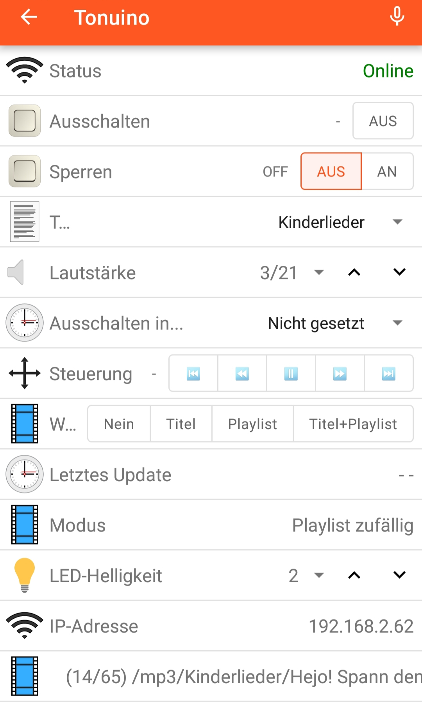
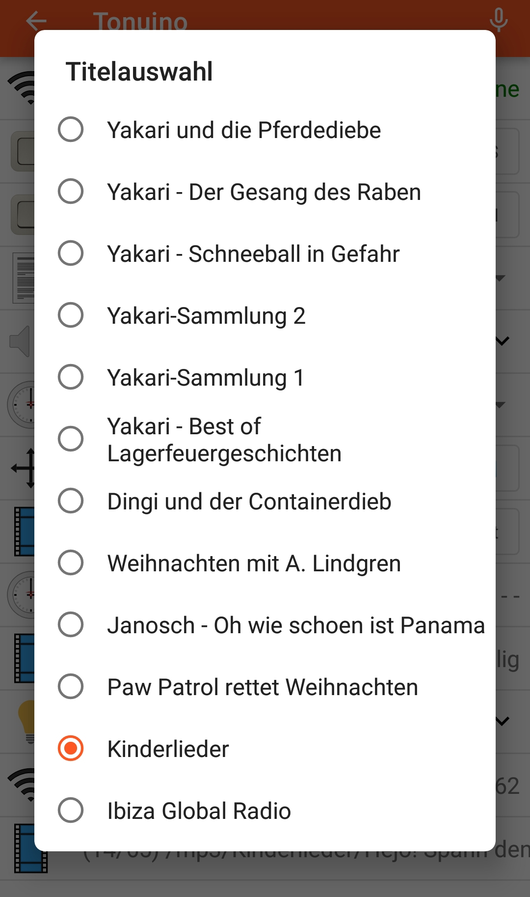
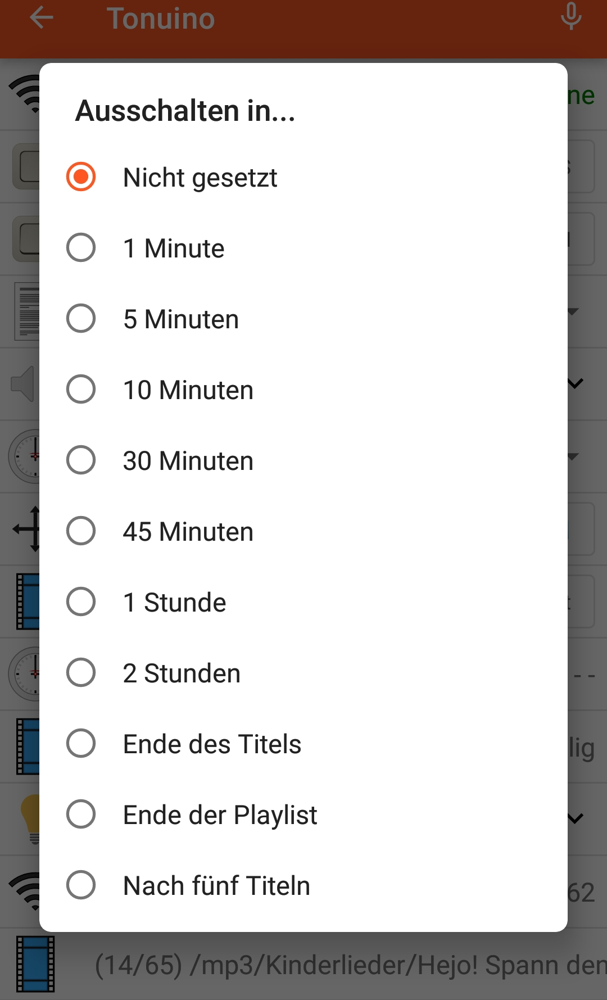

# OpenHAB-integration for ESPuino

## Disclaimer
[OpenHAB](https://www.openhab.org/) is a pretty complex software for home automation. I just extracted that parts of my local config, that are necessary for ESPuino. Hopefully I didn't forget anything :-) Said this I want to rule out I didn't test this minimal setup and that this document's aim isn't to provide a fully-featured howto. For further informations please have a look at the project's [documentation](https://www.openhab.org/docs/) or the [community](https://community.openhab.org/).

## What's necessary (hardware)
* I always recommend Raspberry Pi as it consumes only a few watts.
* Make sure to at least use model 3b+. If you don't yet own a Raspi, go for Raspi 4b with at least 2 GB of RAM (maybe better 4 GB).
* Important is a good power supply. If in doubts use the [official one](https://www.amazon.de/Raspberry-Pi-offizielles-Netzteil-Model/dp/B07TMPC9FG). Better don't use one from an "old cellphone" as it's hard to know if it fits Raspi's needs.
* Raspberrys usually use µSD-card as main-storage. In general, this is fine and tiny-sized as well, but the problem is, that openHAB logs extensively. And unfortunately this is something, that µSD don't like so this probably leads to fast wear. So better use a SSD instead of µSD. Unfortunately, Raspi4b doesn't support to boot from SSD out-of-the-box. Please refer these [instructions](https://kofler.info/usb-boot-fuer-den-raspberry-pi-4/) to know what's necessary to "persuade" Raspi4b to boot from an USB-drive. Trust me: it's really worth it to use a SSD-drive. Especially with a Raspi4b (that provides USB3) it's much much more faster than µSD.
* Good news for people using Raspi3b+: it supports booting from USB-drive out-of-the-box.
## What's necessary (software)
* In order to make use of my config-files you need to have a running openHAB-installation. Mine is running on a Raspberry Pi 4b (4GB Ram) with openHAB3. In general there are two ways to install openHAB:
* [Raspberry Pi OS with manual openHAB-installation](https://www.openhab.org/docs/installation/rasppi.html)
* [openHABian](https://www.openhab.org/docs/installation/openhabian.html). After testing it myself I also recommend to use openHABian as it's much simplier.
* Make sure to choose openHAB3 as openHAB2 will be discontinued mid-term.
* After completing the installation, [UI](http://<ip>:8080) should be browsable. In order to get ESPuino running you need at least the MQTT-binding (Add-ons -> Bindings) and the Map-transformation (Add-ons -> transformations). And you need to setup items, rules and sitemap.
* Beside of openHAB you need a MQTT-broker. You can use a public one but if there's already a Raspberry Pi running with openHAB, it probably makes sense to install [Mosquitto](https://mosquitto.org/) as MQTT-broker in parallel.

## GUI or text?
* When it comes to configuration, there are two possibilities: GUI or txt-Files.
* It seems to be sorta religion of which one to choose :-) However, as of openHAB3, GUI is simplier, but's a lot of stuff to click that would be probably faster to configure as text-file. Refer [this one](https://www.openhab.org/docs/configuration/#textual-vs-graphical-configuration) for further informations.
* Please note: my examples are txt-based and taken from openHAB2. With changing from openHAB2 to openHAB3, I moved over to configuration via GUI. Anyway: the sitemap still needs to be configured as txt-file.
## MQTT
After your MQTT-broker is set up have look at mqttConnections.things in order to configure the MQTTT-connection between openHAB and the broker. In doubt restart openHAB as changes sometimes don't get recognized immediately without restart. If nothing happens have a look at the logfiles /var/log/openhab/openhab.log or /var/log/openhab/events.log. In general, to debug MQTT-stuff, [MQTT fx](https://mqttfx.jensd.de/) is a good tool to refer.

## How does it look like?
Depends on you like it :-) Here's some screenshots of my sitemap-presentation as described in my GitHub-repository.
App's screen when ESPuino is running and playing a music-folder: 

RFID-tags can also be 'emulated' via app. It's not really comfortable, as this list isn't synced with the RFIDs known to ESPuino, but at least it's possible (+handy for a few RFIDs): 

Sleep-timer can be adjusted this way: 

When ESPuino is not online (doesn't matter if deepsleep or totally powered off): 
